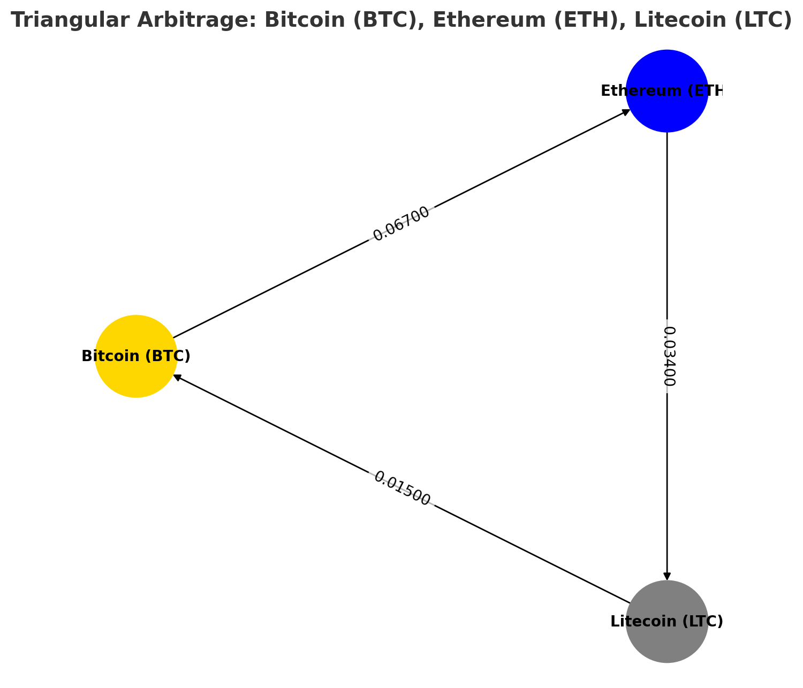

# Cryptocurrency Triangular Arbitrage Simulation – Identifying Market Disequilibrium

## Background
Cryptocurrency markets, due to their volatile nature, often experience disequilibrium—a difference in exchange rates between currencies. This creates arbitrage opportunities where traders can cycle through three assets and generate risk-free profits by exploiting these inefficiencies. However, real-time arbitrage requires automation, speed, and advanced data processing techniques.  

The diagram below illustrates an example of this process:

- **BTC → ETH** (Exchange Rate: X)
- **ETH → USDT** (Exchange Rate: Y)
- **USDT → BTC** (Exchange Rate: Z)

## Executive Summary
This project implements a cryptocurrency triangular arbitrage model, leveraging real-time market data and graph-based algorithms to identify arbitrage opportunities across 11 different cryptocurrencies. The system integrates CoinGecko’s API to fetch live exchange rates and constructs a weighted graph of cryptocurrency exchange rates using NetworkX to detect arbitrage cycles.  

Paper trading, a simulated trading strategy using real-time market data with virtual funds, is used to assess the model’s real-world profitability. Trades are executed using Alpaca’s API. The script was developed using object-oriented programming (OOP) to reduce redundancy and enhance reusability. The model achieved returns as high as **1.8% per cycle**, with each execution traversing the graph to evaluate over **1,900 potential arbitrage paths**.

## Key Questions
I selected this project to answer the following key questions:  
1. How frequently do profitable arbitrage opportunities arise in real-time markets?  
2. How do price discrepancies fluctuate, and how can they be detected efficiently?  
3. What challenges arise when attempting to execute arbitrage trades, and how can they be mitigated?  

## How It Works  
### 1️⃣ Fetching Real-Time Cryptocurrency Data  
- The script calls CoinGecko’s API to retrieve exchange rates across 11 cryptocurrencies.  
- A directed graph is constructed where nodes represent cryptocurrencies, and edges represent exchange rates.  

### 2️⃣ Constructing the Arbitrage Model  
- NetworkX is used to build a weighted graph for exchange rates.  
- The algorithm searches for triangular cycles where a sequence of trades results in a net gain.  
- Arbitrage factors determine potential profitability.  

### 3️⃣ Trading Execution  
- Uses Alpaca’s API to execute paper trades in a simulated environment.  
- Buys and sells assets along arbitrage paths using USD as an intermediary currency.  
- Ensures trades are only executed when the profit factor is positive.  

### 4️⃣ Data Logging & Analysis  
- Logs arbitrage opportunities to CSV files for further analysis.  
- Stores executed trades and Alpaca account balances in JSON format.  

## Key Findings & Insights  

### Market Efficiency Observations  
- Profitable arbitrage opportunities are rare and highly time-sensitive, often lasting only a few seconds.  
- Execution timing is critical—delays in placing orders can eliminate profit margins.  

### Graph-Based Arbitrage Detection  
- Using directed graph analysis, the script identified arbitrage paths with factors exceeding 1.05.  
- High-liquidity assets (BTC, ETH, USDT) were the most profitable, while low-volume assets introduced pricing inconsistencies.  

### Trading Execution Challenges  
- API rate limits and response times introduce execution delays, reducing trade feasibility.  
- Market slippage and transaction fees reduce profitability—accounting for fees prevents false arbitrage signals.  

### Paper Trading Outcomes  
- While the model identified arbitrage paths, actual execution in a paper trading environment resulted in fewer successful trades due to API limitations and price fluctuations.  
- Achieved profits as high as **1.8% per arbitrage cycle**.  
